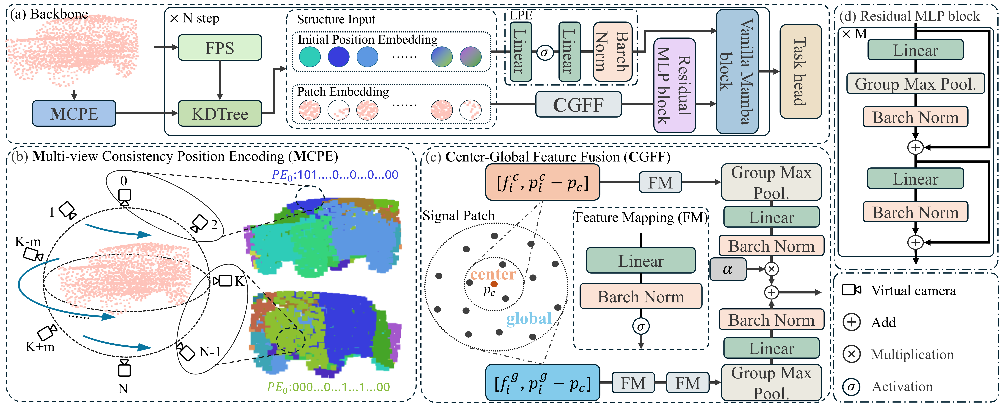
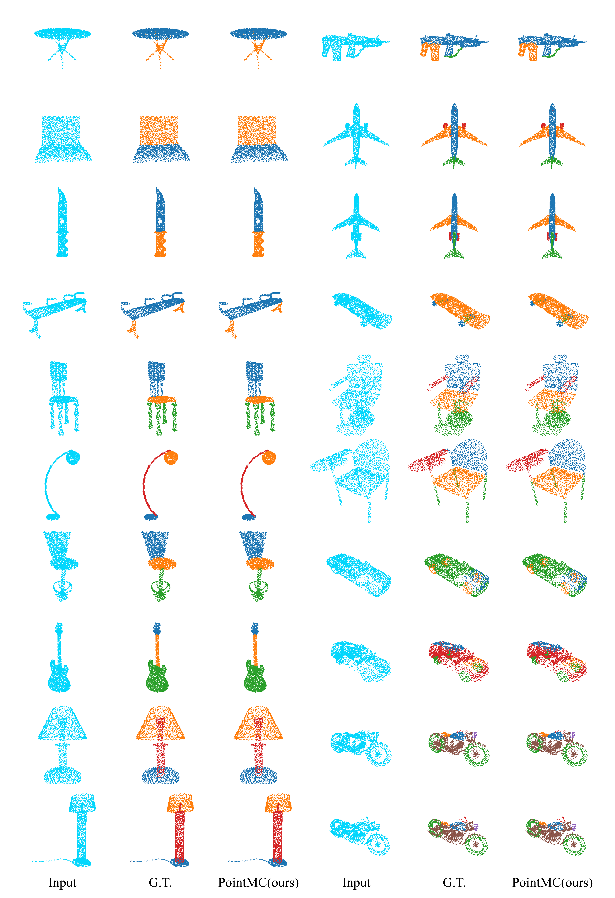

<!-- PointMC: Multi-view Consistent Encoding and Center-Global Feature Fusion for Point Clouds Understanding -->

# This repository is the implementation of the paper:

**[\[AAAI 2026\] PointMC: Multi-view Consistent Encoding and Center-Global Feature Fusion for Point Clouds Understanding](https://ojs.aaai.org/index.php/AAAI/issue/view/695)**.

> TL;DR: The framework ***PointMC*** including **Multi-view Consistent Learnable Position Encoding (MCLPE)** and **Center-Global Feature Fusion (CGFF)**, to provide **semantically coherent** positional guidance for inter-patch and enable **fine-grained geometric structure** aggregation within intra-patch regions.
> - **Multi-view Consistency Learnable Position Encoding** Enabling relative position modeling between patches while reducing position semantic ambiguity from patch overlap.
> - **Center-Global Feature Fusion**: efficiently capturing and extracting fine-grained features of local geometric structures.
> 
> Extensive experiments on ScanObjectNN, ShapeNetPart, S3DIS and ModelNet40 confirm that PointMC consistently surpasses prior SOTA methods.
>  

<!-- 

    

 -->

## Main Results

### Semantic Segmentation on S3DIS Dataset

| Method          | Ref.      | Area5   | 6-fold  |
|-----------------|-----------|---------|---------|
| PDNet-XXL       | AAAI'24   | 72.3    | 78.3    |
| PointDif        | CVPR'24   | 70.0    | /       |
| PCP-MAE         | NeurIPS'24| 61.3    | /       |
| Sonata          | CVPR'25   | 76.0    | 82.3    |
| PCM             | AAAI'25   | 74.1    | /       |
| DeepLA-120      | CVPR'25   | 75.7    | 79.8    |
| CamPoint        | CVPR'25   | 83.3    | /       |
| **PointMC**     | AAAI'26   | **83.6**| **87.4**|

*Table: Semantic segmentation results (%) on the S3DIS dataset are evaluated on Area5 and 6-fold cross-validation.*

<!-- 

    

    

 -->

### Shape Classification on ScanObjectNN Dataset
| Method          | Ref.       | Input | OA    | mAcc  | Params    |
|----------------|------------|-------|-------|-------|-----------|
| PointMamba     | NeurIPS'24 | 2k    | 89.3  | /     | 12.3M     |
| Point-FEMAE    | AAAI'24    | 2k    | 90.2  | /     | 27.4M     |
| PCP-MAE        | NeurIPS'24 | 2k    | 90.4  | /     | 22.1M     |
| PCM            | AAAI'25    | 1k    | 88.1  | 86.6  | 34.2M     |
| DeepLA-24      | CVPR'25    | /     | 90.6  | 89.5  | /         |
| SI-Mamba       | CVPR'25    | 2k    | 89.1  | /     | 12.3M     |
| CamPoint       | CVPR'25    | 1k    | 92.1  | 91.1  | **11.7M** |
| **PointMC**    | AAAI'26    | 1k    | **93.4** | **92.7** | **11.7M** |

*Table: Classification results (%) on the ScanObjectNN are evaluated on the most challenging PB_T50_RS variant.*

## Part Segmentation on ShapeNetPart Dataset
| Method       | Ref.       | Ins. mIoU | Cls. mIoU |
|--------------|------------|-----------|-----------|
| Point-FEMAE  | AAAI'24    | 86.3      | 84.9      |
| PointMamba   | NeurIPS'24 | 86.2      | 84.4      |
| SI-Mamba     | CVPR'25    | 86.1      | /         |
| PCM          | AAAI'25    | **86.9**  | 85.0      |
| SAMBLE       | CVPR'25    | 86.7      | 84.5      |
| DAFNet       | CVPR'25    | 86.8      | 85.2      |
| SI-Mamba     | CVPR'25    | 85.9      | /         |
| **PointMC**  | AAAI'26    | **86.9**  | **85.4**  |

*Table: Part segmentation results (%) on ShapeNetPart. The mIoU for all classes (Cls.) and instances (Ins.) are reported.*
<!-- 

    

 -->

##  The Visualization of MCPE

<!-- 

    

 -->

## Usage Guide

Setup python environment: [SETUP.md](./SETUP.md)

Train and test datasets: 
- [ModelNet40](./modelnet40)
- [S3DIS](./s3dis)
- [ScanObjectNN](./scanobjectnn)
- [ShapeNetPart](./shapenetpart)

<!-- ## Model Zoo -->

<!-- - checkpoints and train logs: https://huggingface.co/MTXAI/CamPoint/tree/main/exp -->
<!-- - test logs: https://huggingface.co/MTXAI/CamPoint/tree/main/exp-test -->
<!-- - tensorboard: https://huggingface.co/MTXAI/CamPoint/tensorboard -->

## Citation

If you find CamPoint method or codebase useful, please cite:

@inproceedings{yu2026pointmc,\
&emsp;&emsp;title={PointMC: Multi-view Consistent Encoding and Center-Global Feature Fusion for Point Clouds Understanding},\
&emsp;&emsp;author={Yu, Xinxing and Liu, Ajian and Qiang, Sunyuan and Wang, Yuzhong and Ma, Hui and Liang, Yanyan},\
&emsp;&emsp;booktitle={Proceedings of the AAAI Conference on Artificial Intelligence},\
&emsp;&emsp;volume={40},\
&emsp;&emsp;number={14},\
&emsp;&emsp;pages={12169--12177},\
&emsp;&emsp;year={2026}\
}

<!-- >  -->
<!-- >  -->

## Acknowledgments

- CamPoint: https://github.com/MTXAI/CamPoint
- PointNext: https://github.com/guochengqian/PointNeXt
- mamba: https://github.com/state-spaces/mamba
- DeLA: https://github.com/Matrix-ASC/DeLA
- pytorch3d: https://pytorch3d.org/